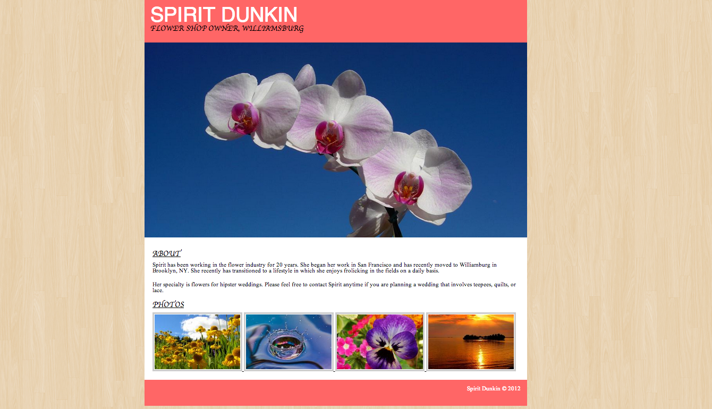

# Hippy Portfolio

Your client, Spirit Dunkin, has hired you to build the site for her flower shop. She has provided a mockup, in addition to all the images she wants to include. Your jobs is to update the html and css in the starter code to match her design as closely as possible.

